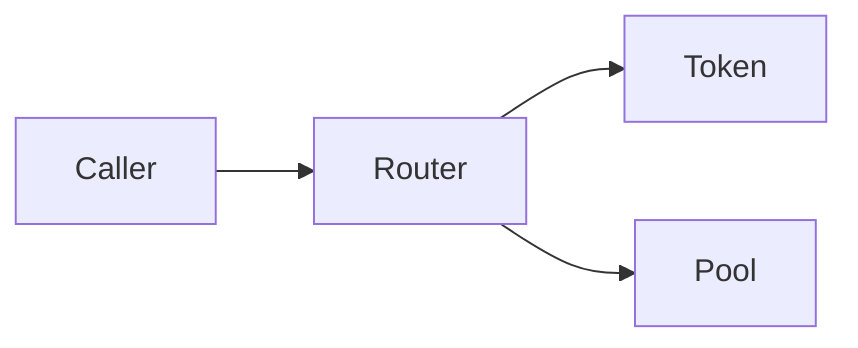

# Chain Analysis Report

## Executive Summary
- Transaction:
- Network:
- Block:
- Status:

## Key Findings
1.
2.
3.

## Flow Diagram



## Addresses
- User:
- Router:
- Token:
- Pool:

## Decoded Events

| Event | Contract | Parameters | Value |
|---|---|---|---|

## Net Token Movements
- Inflows:
- Outflows:
- Net change:

## Security Notes
- Approval pattern:
- Slippage/mev signal:

## Reproducibility

```bash
# 1) Primary retrieval command

# 2) Secondary verification command
```

## Open Questions
-
